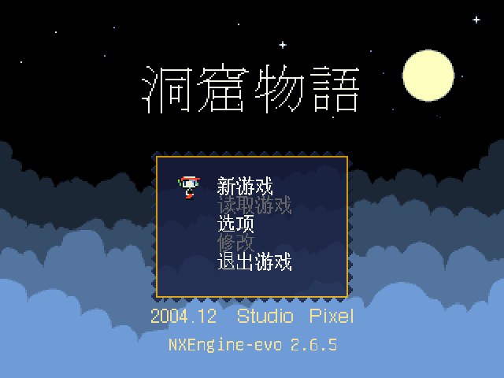
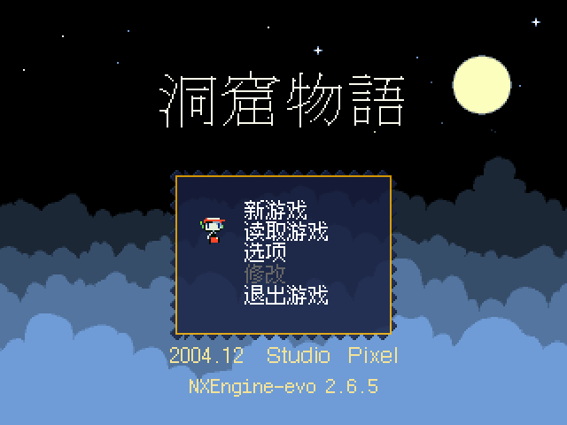

# nxengine-evo-dist

  <figure style="display:inline-block;margin:10px;max-width:350px;vertical-align:top;text-align:center;">
    
    <figcaption><strong>Unifont</strong></figcaption>
  </figure>

  <figure style="display:inline-block;margin:10px;max-width:350px;vertical-align:top;text-align:center;">
    
    <figcaption><strong>Ark Pixel</strong></figcaption>
  </figure>

